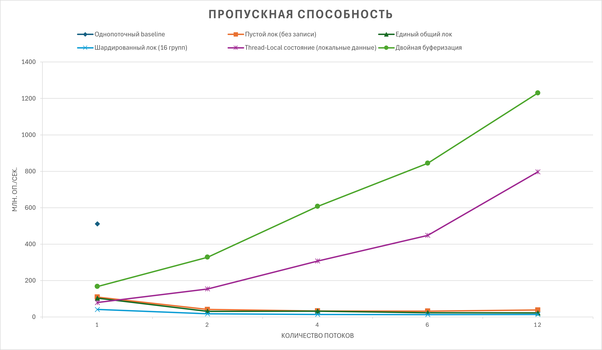
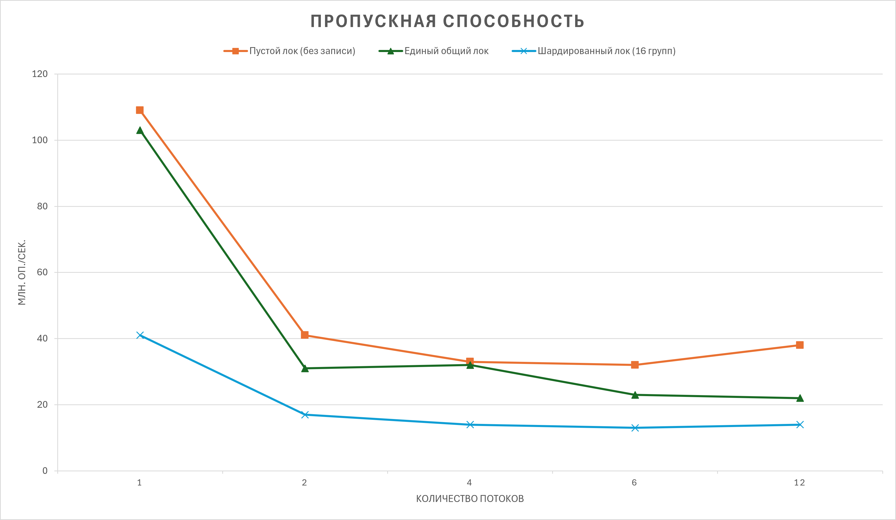

# Лабораторная работа: Коллектор метрик

## Результаты и выводы

### 1. Характеристики тестового стенда
- **Процессор (CPU):** *AMD Ryzen 5 9600X*
- **Число логических процессоров (`nproc`):** *12*
- **Язык и версия:** *C++20 (GCC 14.2)*

## 2. Замеры пропускной способности (млн оп/сек)

| Число потоков (T) | 1 поток | 2 потока | 4 потока | 6 потоков | 12 потоков |
| :--- | :---: | :---: | :---: | :---: | :---: |
| **Этап 0:** Однопоточный baseline | 511 | — | — | — | — |
| **Этап 1:** Пустой лок (без записи) | 109 | 41 | 33 | 32 | 38 | 
| **Этап 1:** Единый общий лок | 103 | 31 | 32 | 23 | 22 | 
| **Этап 2:** Шардированный лок (16 групп) | 41 | 17 | 14 | 13 | 14 | 
| **Этап 3:** Thread-Local состояние (локальные данные) | 79 | 154 | 307 | 448 | 797 | 
| **Этап 4:** Двойная буферизация | 167 | 328 | 607 | 844 | 1230 | 

Без высокопроизводительных коллекторов:

### 3. Результаты стресс-теста согласованности снимков

| Реализация | Доля битых снимков (sum != count) | Снимок: sum < count | Снимок: sum > count | Итоговый count − число вызовов (после join) |
| :--- | :---: | :---: | :---: | :---: |
| **Этап 2:** Шардированный лок | 92% | 7906 раз | 1279 раз | 167685 - 167685 = 0 |
| **Этап 3:** Thread-Local состояние (локальные данные) | 99% | 9914 раз | 9 раз | 663741 - 663741 = 0 |
| **Этап 4:** Двойная буферизация | 0% | 0 раз | 0 раз | 540778 - 540778 = 0 |
| **Этап 4 (без шага 3):** без проверки `active` | 99% | 9939 раз | 0 раз | 642125 - 642127 = -2 |

### 4. Короткие ответы на вопросы

| Вопрос | Ваш ответ |
| :--- | :--- |
| **1. Пустой лок против полного:** Почему пустой лок тоже резко падает с ростом потоков? Что добавляет полная версия? | Потому что большую часть времени занимает именно захват блокировки. По второму графику видно, что полная версия лишь немного медленнее, т.к. непосредственно изменения счетчиков занимают мало времени. |
| **2. Провал шардирования и атомиков:** Почему 16 шардов и атомарная сводка на этапе 2 не спасли скорость записи на законе Ципфа? Куда переехало узкое место? | Дело в том, что по распределению Ципфу большая часть записей будет происходить в первую корзину — за нее большую часть времени и идет борьба. |
| **3. Замедление на этапе 3:** Почему на этапе 3 рост скорости замедляется после 8 потоков? Как это связано с выводом `lscpu`? | Не наблюдаю. Но вообще, у моего процессора все ядра одинаковые: нет разделения на P-ядра и E-ядра. |
| **4. Двойная буферизация против TLS:** Почему этап 4 медленнее этапа 3 (в C++ в 2,5–3,5 раза, в Java в 1,1–1,7 раза, а на 16 потоках Java почти догоняет этап 3), но масштабируется почти линейно? В чём разница инструкций при записи? | Не наблюдаю. |
| **5. Эксперимент с шагом 3:** Что сломалось в тесте на этапе 4, когда вы убрали повторную проверку `active == b`? Почему итоговый `count` расходится с числом вызовов? | В таком случае есть шанс того, что поток будет писать в тот буфер, который собирается читать и обнулять писатель. Возникает гонка данных. |

